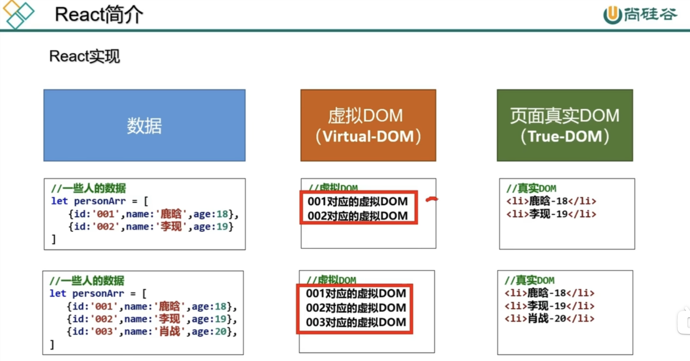

## React Start

### 认识 react

原来的前端页面渲染步骤

- 发送请求获取数据
- 处理数据（过滤、整理格式等）
- **操作 DOM 呈现页面**
  其中 react 主要完成最后一个步骤，因此我们可以将 react 定义为一个将数据渲染为 HTML 视图等开源 JavaScript 库。

### 为什么要使用 React

- 原声 JavaScript 操作 DOM 繁琐、效率低（DOM-API 操作 UI）

```
document.getElementById('app')
```

- 使用 javascript 直接操作 DOM，浏览器会进行大量的重排重绘
- 原生 javascript 没有组件化编码方案，代码复用率低(原声 js 我们采用了模块化的处理方式，现在我们需要将包括 html 和 css 等都做一个模块化的处理，这就是 react 的组件化编码方案)

### react 的特点

- 采用组件化模式，声明式编码，提高开发效率及组件复用率（与命令式编程进行区分）
- 可以使用 React Native 中可以使用 React 语法进行移动端开发（利用 js 就可以进行移动端开发）
- react 使用**虚拟 DOM + 优秀的 diff 算法**，尽量减少与真实 DOM 的交互



### 学习 react 之前需要掌握的 javascript 基础知识

- 判断 this 的指向
- class（类）
- ESC 语法规范
- npm 包管理器
- 原型、原型链
- 数组常用方法
- 模块化
